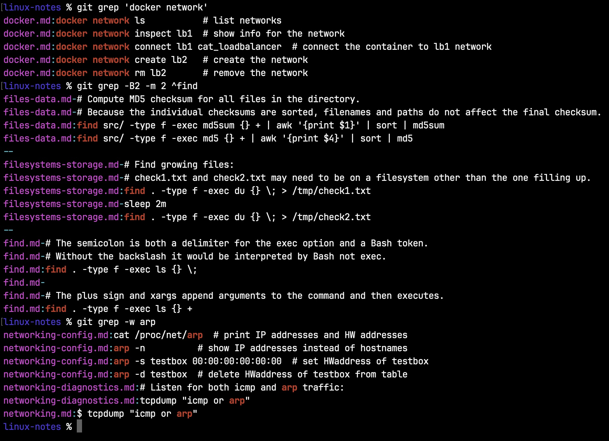
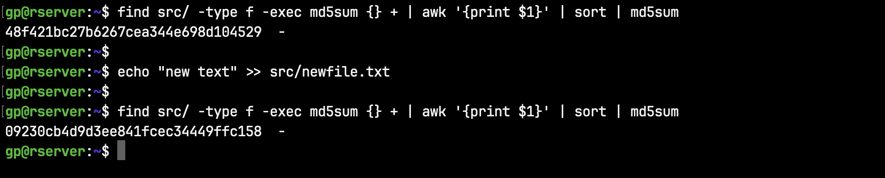
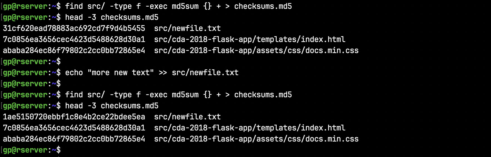

# Little Linux Library


### Linux Notes and Examples

Browse topics in [linux-notes](linux-notes) or clone this repo and use 'git grep' to quickly find examples in multiple contexts.
```shell script
cd linux/linux-notes

git grep awk    # show examples of the awk command
git grep -w df  # show examples of the df command
```

Useful options:
* -B1 : include the previous line, some examples have an explanation above
* -i : ignore case (include **n**etwork and **N**etwork)  
* -n : include line number  
* -w : exclude matches that are part of a word (include **df**, exclude min**df**ul)

The -m option shown here is only used to limit results.



### tldr pages

For more Linux command examples, check out [tldr](https://github.com/tldr-pages/tldr), a collection of simplified man pages.

```shell script
tldr awk  # show examples of the awk command
```

### Other new commands worth checking out

```shell script
lsd        # ls deluxe, more colors and icons, similar to eza

bat        # cat with syntax highlighting and Git integration

fastfetch  # system information, displayed pretty, similar to neofetch

htop       # interactive process viewer
```

### Other Topics

The linux-notes directory also has notes and examples on the following:
* [Ansible](linux-notes/ansible.md)
* [Docker](linux-notes/docker.md)
* [Git](linux-notes/git.md)
* [Python versions, virtual envs, & packages](linux-notes/python-management.md)
* [Vagrant](linux-notes/vagrant.md)

### Favorites

Find whether the content of any files in a directory have been modified. This is done here by computing an md5 checksum for each file in the directory and it's subdirectories. The filenames are filtered out with awk and the checksums are sorted and a combined checksum is generated. This way, whether the files are moved or renamed, the combined checksum will be the same. This method is more thorough then relying on mtime which can be adjusted or changes in file size which do not necessarily reflect changes in file content.

```shell script
find src/ -type f -exec md5sum {} + | awk '{print $1}' | sort | md5sum
```



Here's the example above broken down. This shows that newfile.txt has changed. To see all modified files, redirect the second find command to a separate text file and then run diff on the two.



For more like this, see [favorites](linux-notes/favorites.md)

### Package Updates

To schedule package updates on a laptop or desktop, see [package-updates](package-updates)
