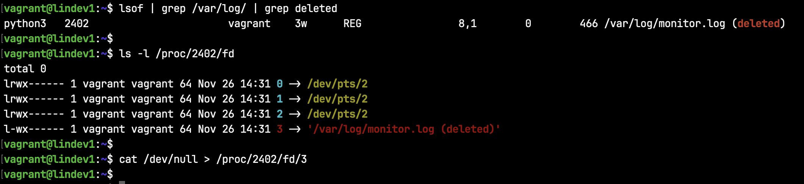
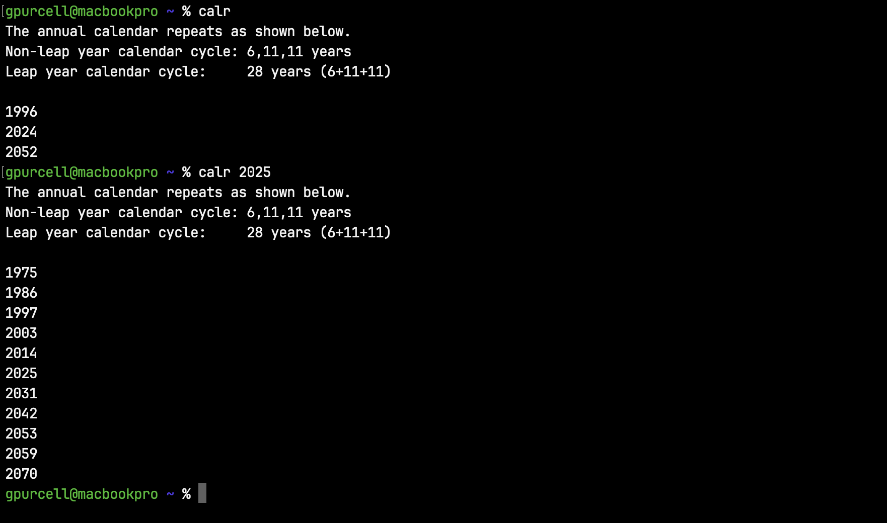

# Favorites

### Find which files are growing

This will find which files in /var/log/ that are growing (or shrinking). The sleep time here is 2 minutes but may need to be longer. The two check files should be created on a separate filesystem if the one being checked is full or almost full.

```shell script
find /var/log/ -type f -exec du {} \; > /tmp/check1.txt
sleep 2m
find /var/log/ -type f -exec du {} \; > /tmp/check2.txt
diff /tmp/check1.txt /tmp/check2.txt
```

### Free disk space by file descriptor

This screenshot shows that /var/log/monitor.log has been deleted but is still open. More accurately, the file descriptor, /proc/2402/fd/3, for the log file still exists. In this case the size shows as 0 bytes but would otherwise hold disk space until the process is killed. To avoid causing problems with the running application, null the file descriptor itself.



### Checking a directory for file modifications

This will find whether the content of any files in a directory have been modified. This is done here by computing an md5 checksum for each file in the directory and it's subdirectories. The filenames are filtered out with awk and the checksums are sorted and a combined checksum is generated. This way, whether the files are moved or renamed, the combined checksum will be the same. This method is more thorough then relying on mtime which can be adjusted or changes in file size which do not necessarily reflect changes in file content.

```shell script
find src/ -type f -exec md5sum {} + | awk '{print $1}' | sort | md5sum
```


Here's the example above broken down. This shows that newfile.txt has changed. To see all modified files, redirect the second find command to a separate text file and then run diff on the two.


For more like this, see [Checksums, Directory compare](files-data.md#checksums-directory-compare)

### Find when an annual calendar repeats

This happens when the day of the month and day of the week are the same in multiple annual calendars. This one's just for fun.

```shell script
calr() {
    YEAR_ARG=$1
    echo "The annual calendar repeats as shown below."
    echo "Non-leap year calendar cycle: 6,11,11 years"
    echo "Leap year calendar cycle:     28 years (6+11+11)"; echo

    for YEAR in {1970..2070}; do
        diff -q <(cal -y $YEAR_ARG | tail -34) <(cal $YEAR | tail -34) > /dev/null && echo $YEAR
    done
}
```


