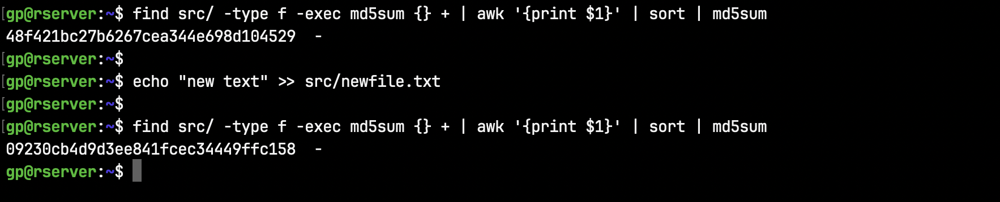

# Favorites

### Checking a directory for changes

Find whether any files in a directory have changed. This is done here by computing an md5 checksum for each file in the directory and it's subdirectories. Then the filenames are stripped with awk and the checksums are sorted and a combined checksum is generated. This way, whether the files are moved or renamed, the combined checksum will be the same.

```shell script
find src/ -type f -exec md5sum {} + | awk '{print $1}' | sort | md5sum
```



Here's the example above broken down.


For more like this, see [Checksums, Directory compare](files-data.md#checksums-directory-compare)

### Find when an annual calendar repeats.

This happens when the day of the month and day of the week are the same in multiple annual calendars. This one's just for fun.

```shell script
calr() {
    YEAR_ARG=$1
    echo "The annual calendar repeats as shown below."
    echo "Non-leap year calendar cycle: 6,11,11 years"
    echo "Leap year calendar cycle:     28 years (6+11+11)"; echo

    for YEAR in {1970..2070}; do
        diff -q <(cal -y $YEAR_ARG | tail -34) <(cal $YEAR | tail -34) > /dev/null && echo $YEAR
    done
}
```


