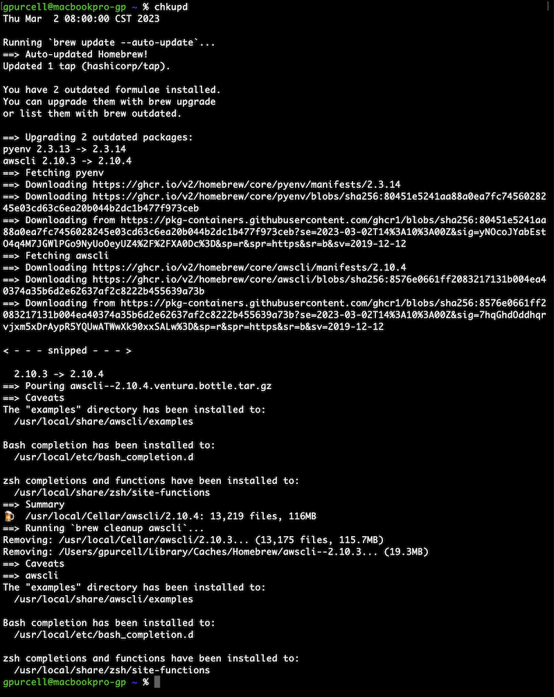

# Package Updates
##### Schedule package updates on your device during a daily window.

## macOS

Run the following to get the upgrade script ready.
```shell script
cp crontabs/brew-upgrade.sh ~/.local/bin/              # copy the package upgrade script to your .local/bin/
sed -i '' "s/user1/$USER/" .local/bin/brew-upgrade.sh  # replace user1 in the script with your user
ls -l ~/.local/bin/brew-upgrade.sh                     # verify that the script is executable
```

Add a crontab entry to schedule the [brew-upgrade.sh](crontabs/brew-upgrade.sh) script. See [brew-upgrade.cron](crontabs/brew-upgrade.cron) for example.
```shell script
crontab -e
```

Add these aliases to your **.zshrc** file. The **chkupd** alias requires the **chklog** function below.  The upd alias runs updates manually.
```shell script
alias upd="{ date; echo; brew upgrade; } | tee ~/cron/cron.brew.out 2>&1"
alias chkupd='chklog ~/cron/cron.brew.out'
```

## Ubuntu

Run the following to get the upgrade script ready.
```shell script
cp crontabs/apt-upgrade.sh ~/.local/bin/  # copy the package upgrade script to your .local/bin/
ls -l ~/.local/bin/apt-upgrade.sh         # verify that the script is executable
```

Add an entry to root's crontab to schedule the [apt-upgrade.sh](crontabs/apt-upgrade.sh) script. See [apt-upgrade.cron](crontabs/apt-upgrade.cron) for example.
```shell script
sudo crontab -e
```

If you're using WSL, start cron manually, or add this service command to your **.bashrc** file. This requires passwordless sudo privilege to run.
```shell script
{ service cron status || sudo service cron start; } > /dev/null
```

Add these aliases to your **.bash_aliases** file. The **chkupd** alias requires the **chklog** function below. The upd alias runs updates manually but does not write to the cron.apt.out file.
```shell script
UPD_CMD='"apt update && apt -y dist-upgrade && apt -y autoremove"'
alias upd="echo $UPD_CMD; sudo sh -c $UPD_CMD"
alias chkupd='chklog /var/log/cron.apt.out'
```

## Check Log

* Add the chklog function to **~/.zshrc** on macOS and **~/.bashrc** on Linux.
* This fits the log file to the terminal by showing only the first and last few lines based on the terminal size.
* Use the **chkupd** aliases above to run this function against the package update out file.
* Remember to source the bash/zsh files you've updated or just close and repoen your terminal window after updating these files.

```shell script
chklog() {
    LOG_FILE=$1
    TERM_LINES=$(tput lines)
    TERM_COLS=$(tput cols)
    TERM_LINES_REMAINDER=$(($TERM_LINES % 2 ))
    LOG_FILE_FOLDED=$(fold -w $TERM_COLS $LOG_FILE)
    HEAD_LINES=$(($(($TERM_LINES / 2)) -2 ))
    TAIL_LINES=$(($(($TERM_LINES / 2)) -3 + $TERM_LINES_REMAINDER ))
    LOG_FILE_FOLDED_LC=$(echo "$LOG_FILE_FOLDED" | wc -l | xargs | cut -f 1 -d " ")

    if [[ $LOG_FILE_FOLDED_LC -le $(($TERM_LINES - 2)) ]]; then
        echo "$LOG_FILE_FOLDED"
    else
        echo "$LOG_FILE_FOLDED" | head -$HEAD_LINES
        printf "\n< - - - snipped - - - >\n\n"
        echo "$LOG_FILE_FOLDED" | tail -$TAIL_LINES
    fi
}
```


